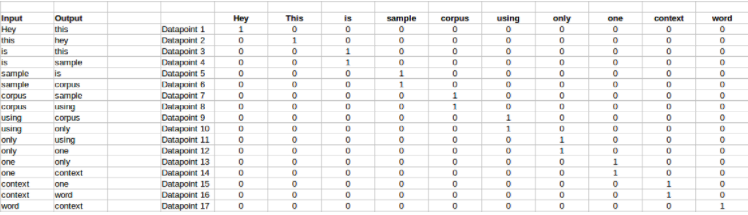
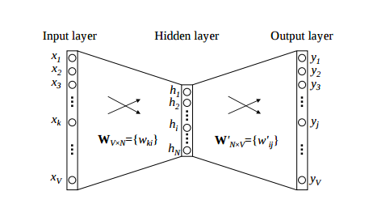
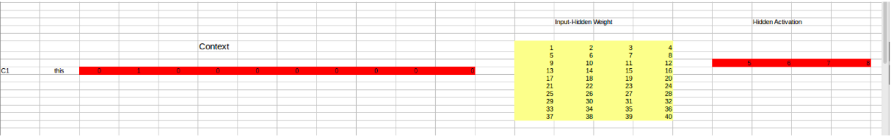
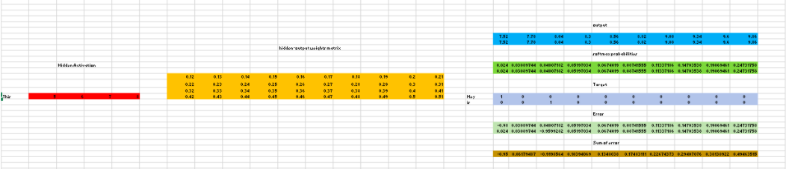

# Word2Vec Points

## What are Word Embeddings?
* Words embedding tries to map a word to a vector using a dictionary.
* Used as a main method of representation of data for ML/DL

## Types of Word Embeddings
There are 2 kinds of word embeddings

* *Frequency Based Word Embeddings*
* *Prediction Based Word Embeddings*

### Frequency based Embeddings
The three types of vectors encountered under this category are

* *Count Vector*
* *TF-IDF Vector*
* *Co-Occurence Vector*

#### *Count Vector*
```
Corpus = C
No of Documents = D
Number of Unique Tokens = N
Size of Count Vector Matrix = D X N
```
<br>
```
An Example:
D1: He is a lazy Boy, She is also lazy.
D2: Neeraj is a lazy person
```

#### TF-IDF Vector
* Takes into account the occurence of a word in the full context instead of a particular document 
* Common Words like 'the', 'a' occur more frequently in a document than relavant context work and hence lower weights are assigned to these words than the document specific words
* Formula for `IDF(word)` is `log(Number of Documents/number of Documents having word)`

#### Co-Occurence Vector
* Rationale: Similar words tend to occur together and have similar context
* Co-occurrence – For a given corpus, the co-occurrence of a pair of words say w1 and w2 is the number of times they have appeared together in a Context Window.
* Context Window – Context window is specified by a number and the direction
* Advantages:
    - It preserves the semantic relationship between words. i.e man and woman tend to be closer than man and apple.
    - It uses SVD at its core, which produces more accurate word vector representations than existing methods.
    - It uses factorization which is a well-defined problem and can be efficiently solved.
    - It has to be computed once and can be used anytime once computed. In this sense, it is faster in comparison to others. 
* Disadvantages:
    - It requires huge memory to store the co-occurrence matrix.
But, this problem can be circumvented by factorizing the matrix out of the system for example in Hadoop clusters etc. and can be saved. 

### Prediction Based Embeddings

* Deterministic systems replaced by probabilistic models to generate word vectors
* Word2Vec has a combination of 2 techniques
    * *CBOW*
    * *SkipGram*

#### Continuous Bag Of Words
* Tries to predict the probability of a word given a context C
* Context maybe a single word or a group of words

* Explanation:

    * C = “Hey, this is sample corpus using only one context word.”
    * The following is the matrix created
    

<br>

* The following is sent into a shallow neural network with three layers: an input layer, a hidden layer and an output layer. The output layer is a softmax layer which is used to sum the probabilities obtained in the output layer to 1


<br>

* The input layer and the target, both are one- hot encoded of size `[1 X V]`. Here `V=10` in the above example.
* There are two sets of weights. one is between the input and the hidden layer and second between hidden and output layer.
Input-Hidden layer matrix `size =[V X N]` , hidden-Output layer matrix  `size =[N X V`] : Where N is the number of dimensions we choose to represent our word in. It is arbitary and a hyper-parameter for a Neural Network. Also, N is the number of neurons in the hidden layer. Here, `N=4`.
* There is a no activation function between any layers.
* The input is multiplied by the input-hidden weights and called hidden activation. It is simply the corresponding row in the input-hidden matrix copied.
* The hidden input gets multiplied by hidden- output weights and output is calculated.
* Error between output and target is calculated and propagated back to re-adjust the weights.
* The weight  between the hidden layer and the output layer is taken as the word vector representation of the word.


<br>


* Advantages of CBOW:
    * Being probabilistic is nature, it is supposed to perform superior to deterministic methods(generally).
    * It is low on memory. It does not need to have huge RAM requirements like that of co-occurrence matrix where it needs to store three huge matrices.
* Disadvantages of CBOWL
    * CBOW takes the average of the context of a word. For example, Apple can be both a fruit and a company but CBOW takes an average of both the contexts and places it in between a cluster for fruits and companies.
    * Training a CBOW from scratch can take forever if not properly optimized.

#### Skip-Gram Model

* The aim of skip-gram is to predict the context given a word
* The input vector for skip-gram is going to be similar to a 1-context CBOW model

Explanation:


<br>

* The row in red is the hidden activation corresponding to the input one-hot encoded vector. It is basically the corresponding row of input-hidden matrix copied.
* The yellow matrix is the weight between the hidden layer and the output layer.
* The blue matrix is obtained by the matrix multiplication of hidden activation and the hidden output weights. There will be two rows calculated for two target(context) words.
* Each row of the blue matrix is converted into its softmax probabilities individually as shown in the green box.
* The grey matrix contains the one hot encoded vectors of the two context words(target).
* Error is calculated by substracting the first row of the grey matrix(target) from the first row of the green matrix(output) element-wise. This is repeated for the next row. Therefore, for n target context words, we will have n error vectors.
* Element-wise sum is taken over all the error vectors to obtain a final error vector.
* This error vector is propagated back to update the weights.

Advantages

* Skip-gram model can capture two semantics for a single word. i.e it will have two vector representations of Apple. One for the company and other for the fruit.
* Skip-gram with negative sub-sampling outperforms every other method generally

